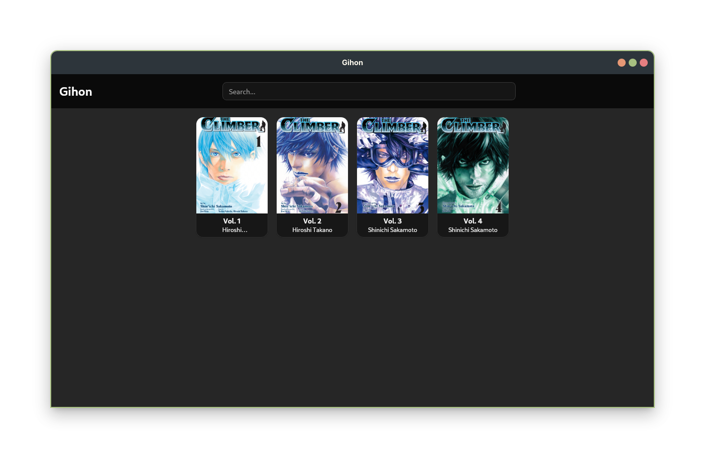

# Gihon 偽本

Desktop manga/comics reader built with Tauri + React.
It lets you import your files, read pages in a focused viewer, and edit metadata quickly.

<p align="center">
    
</p>

<p align="center">
    
    
    
    
    
</p>

## 👀 For users

### ✨ What the app does

- Local library with cards for each manga/comic.
- Drag-and-drop import support.
- Page viewer with "smooth" navigation. (lol)
- Metadata editing from the UI.
- `ComicInfo.xml` extraction when available.
- Imported files and metadata are copied into the app data directory.

### 📦 Supported formats

- `.cbz`
- `.zip`
- `.cbr`
- `.rar`

### ⌨️ Shortcuts inside the viewer

- `ArrowRight`: next page.
- `ArrowLeft`: previous page.
- `F`: toggle fullscreen (only when focus is inside MangaViewer).
- `Esc`: exit fullscreen or close the viewer.

### 🧪 Project status

It's just a hobby; sometimes I'll program a lot, but it's likely I'll disappear, come back, disappear again, and so on.

To Do:

- Add automatic metadata scrapping (probably using Comic Vine API)
- Fix a lot of lags on linux while reading :,(
- Add translations to other languages
- Improve the processing times (yes i talk about the loading files at the start of the app)

## 🛠 For developers

### 🧰 Requirements

- Bun >= 1.1 (recommended: Bun 1.3+) or modify it and use whatever you want lol
- Rust + Cargo
- Tauri system dependencies (vary by OS, check the official docs)

### 🚀 Installation and running

1. Install dependencies:

```bash
bun install
```

2. Run the app in development:

```bash
bun run tauri dev
```

3. Build for production:

```bash
bun run tauri build
```
